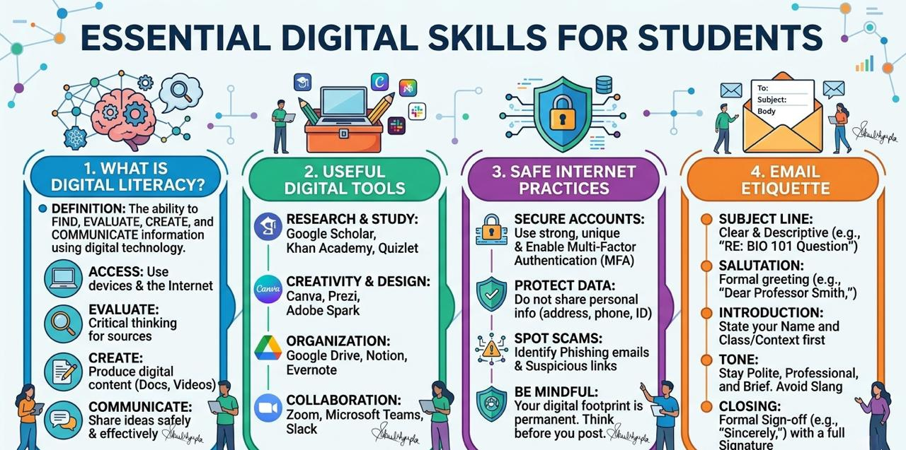
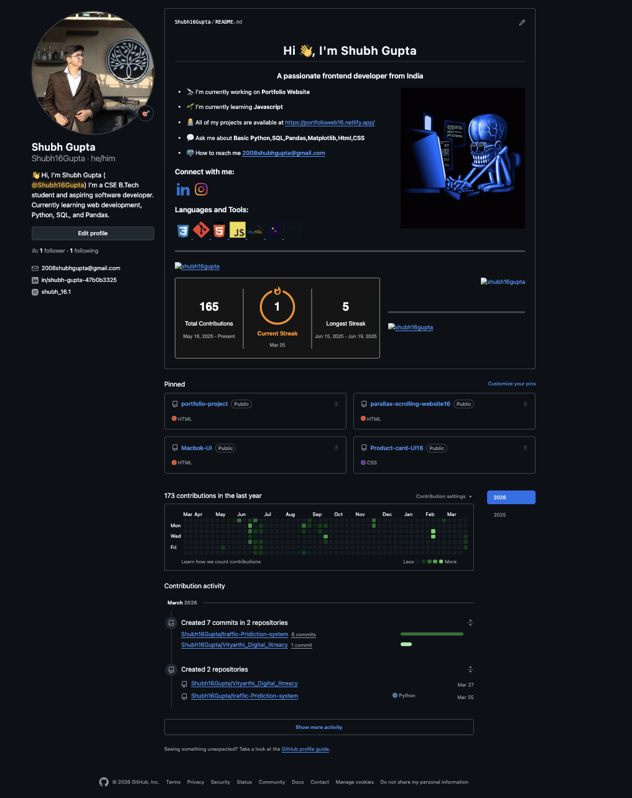
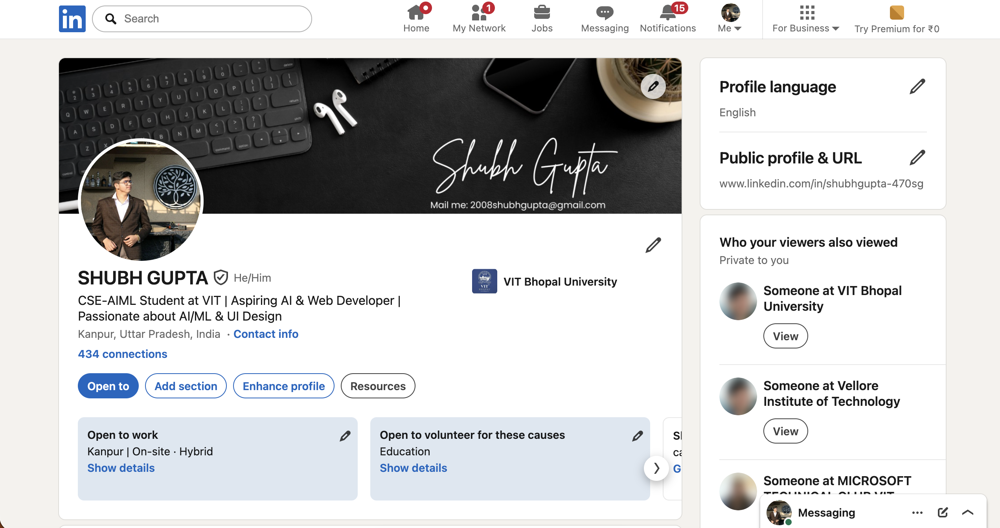
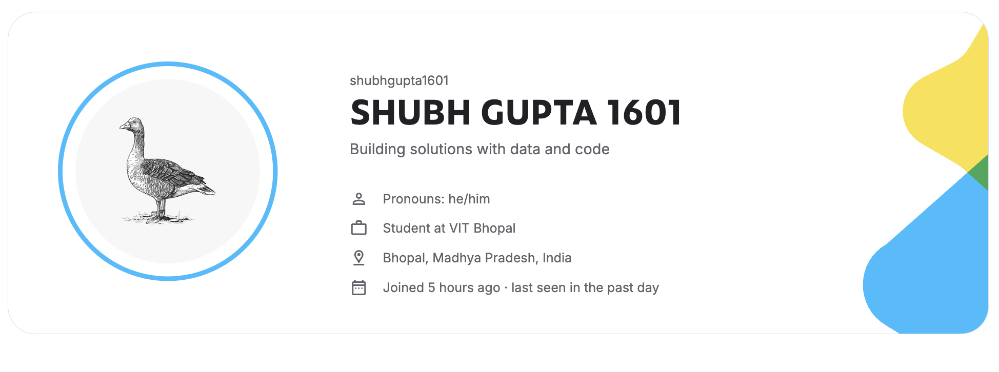

# 📘 Digital Literacy Project

## 👨‍🎓 Student Details
- **Name:** Shubh Gupta  
- **Branch:** CSE AIMl  
- **Year:** BTech 1st year 

---

## 📌 Project Overview
This project is part of the Digital Literacy course, aimed at developing essential skills required to effectively and responsibly use digital technologies. It covers areas such as digital awareness, professional online presence, coding practice, communication etiquette, and cybercrime awareness.

---

## 🧩 Task 1 – Digital Literacy Infographic
Created a one-page infographic explaining:
- What is Digital Literacy  
- Useful Digital Tools  
- Safe Internet Practices  
- Email Etiquette  

📷 Screenshot:  

---

## 🌐 Task 2 – Professional Digital Presence
Platforms created/updated:
- GitHub  
- LinkedIn  
- Kaggle  

📷 Screenshots:  
  
  
  

---

## 💻 Task 3 – Platforms

### 🔹 Coding Practice (HackerRank)
- Completed intermediate-level challenge  

📷 Screenshot:  

---

### 🔹 Digital Literacy Awareness Quiz
Created using Google Forms

🔗 **Google Form Link:**  
https://forms.gle/SBpMTSUVWq9uGTSc6  

🔗 **Responses Sheet:**  
https://docs.google.com/spreadsheets/d/1ggG3ZNk8aQRzIlj457YB2nvE_h1q9QRbRzy_KuVdR6k/edit?usp=sharing  

📷 Screenshots:  
  

---

## 📧 Task 4 – Email Etiquette
- Wrote 2 professional emails:
  - Requesting assignment extension  
  - Applying for internship  
- Created Social Media Do’s & Don’ts checklist  

📁 Files included in:
task-4-email-etiquette/

---

## 🔐 Task 5 – Cybercrime Awareness

### 📄 Case Study
- Topic: Phishing  
- Explained working, targets, and impact  

### ✅ Prevention Checklist
- Stay Safe Online tips  
- Includes UPI safety measures  
- Reporting: cybercrime.gov.in | Helpline 1930  

📁 Files included in:
task-5-cybercrime/

---

## 🎯 Learning Outcomes
- Improved digital literacy and awareness  
- Built professional online presence  
- Enhanced coding and problem-solving skills  
- Learned email etiquette and communication  
- Understood cyber threats and safety practices  

---

## 📚 References
- https://www.canva.com  
- https://github.com  
- https://www.linkedin.com  
- https://www.kaggle.com  
- https://www.hackerrank.com  
- https://forms.google.com  
- https://cybercrime.gov.in  

---

## 🚀 Conclusion
This project helped me develop essential digital skills, improve communication, and become more aware of online safety. It has prepared me to use digital tools effectively for academic and professional growth.
