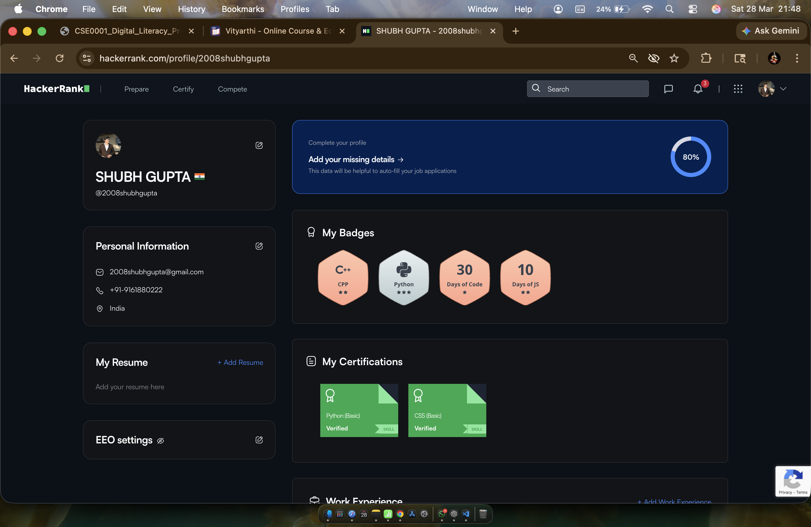
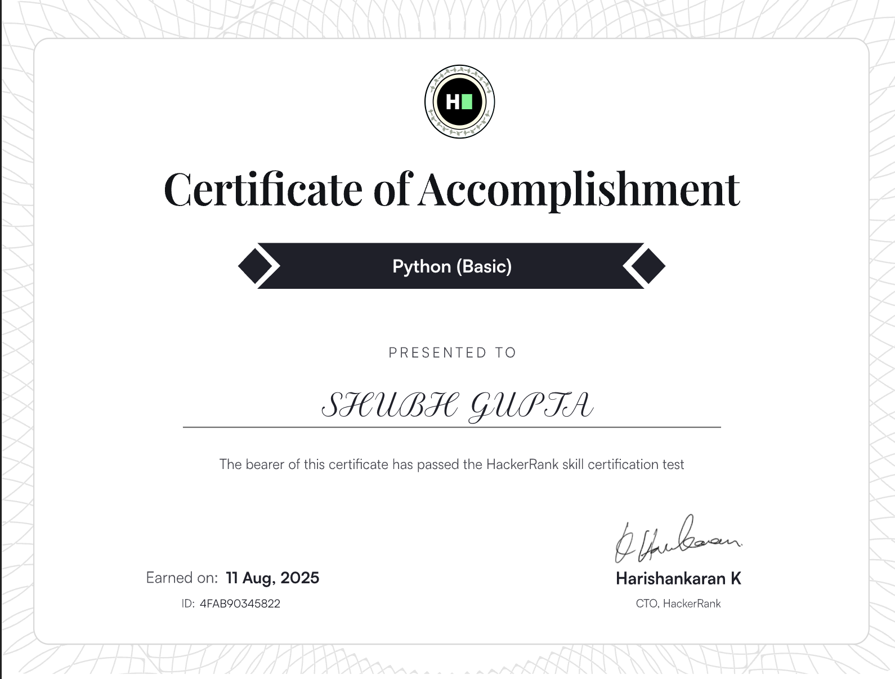
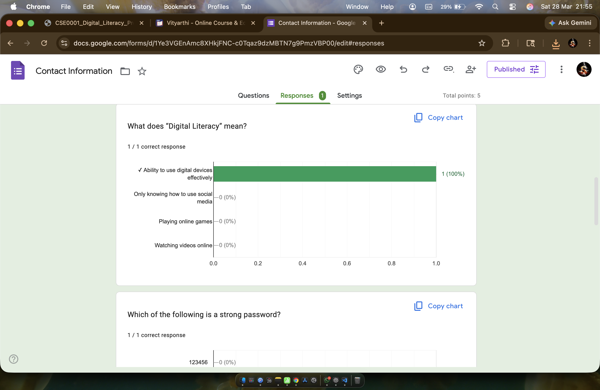
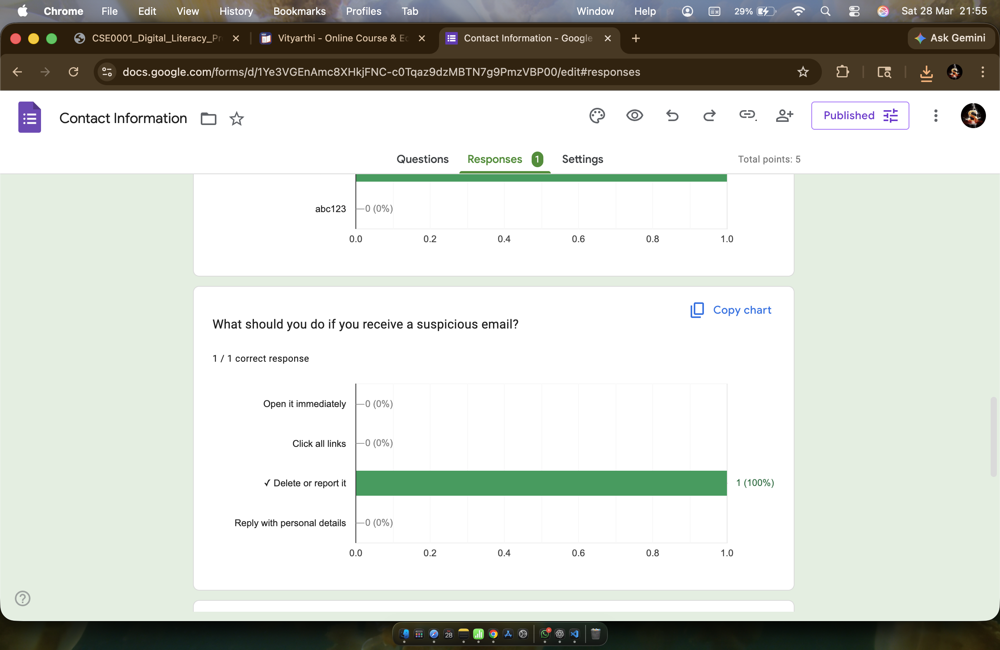
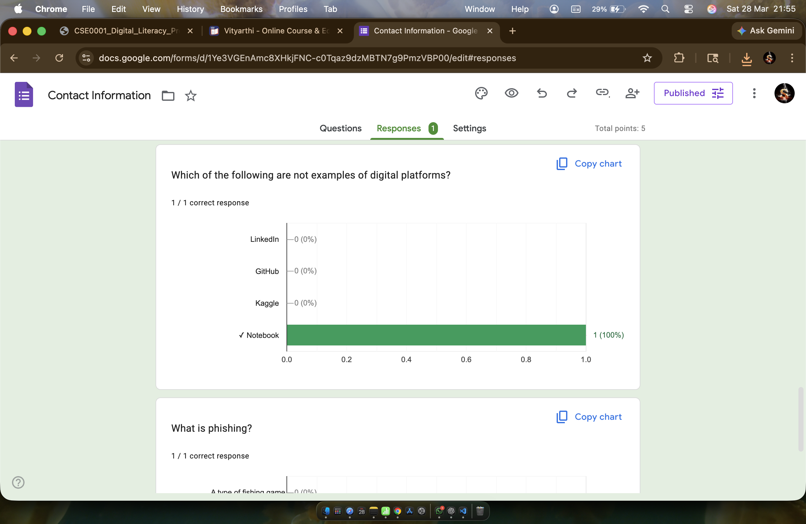
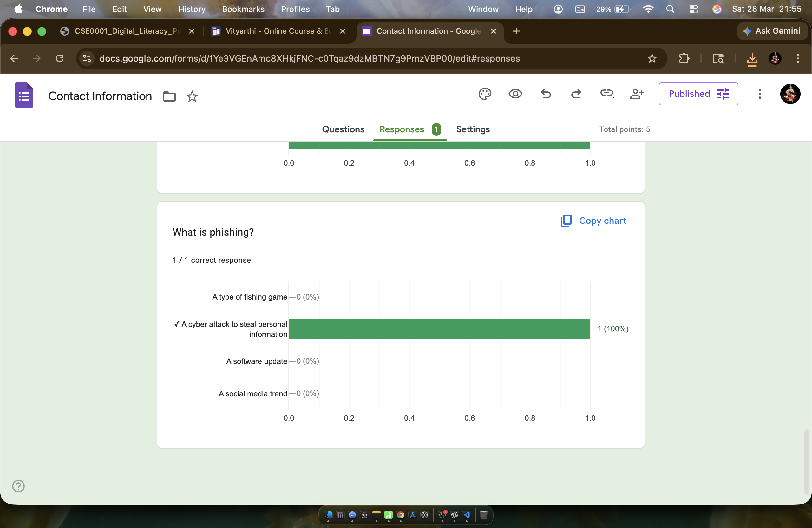
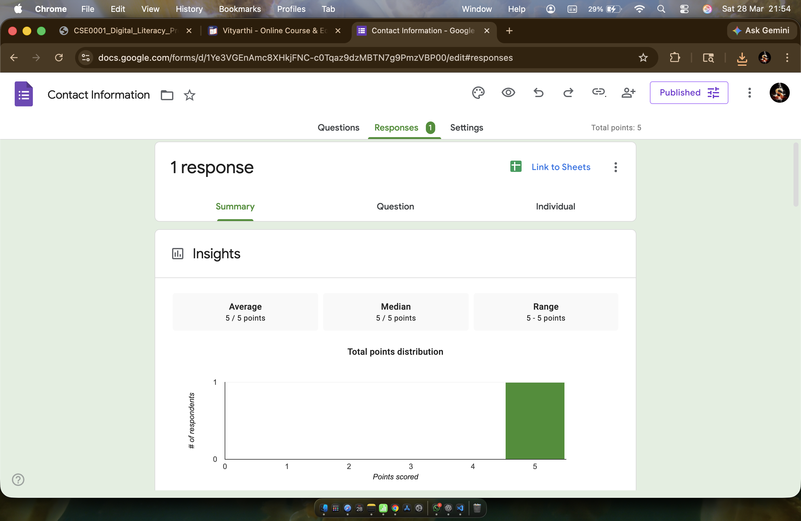

# Task 3: Platforms

## Part 1 - Hacker Rank

# Digital Literacy Awareness Quiz

This quiz is designed to test awareness about digital literacy, online safety, and responsible internet usage among students.

**Google Form Link:**  
https://forms.gle/SBpMTSUVWq9uGTSc6

---

**Google Form response Link:**  
https://docs.google.com/spreadsheets/d/1ggG3ZNk8aQRzIlj457YB2nvE_h1q9QRbRzy_KuVdR6k/edit?usp=sharing

---

## 🧾 About the Quiz

- Total Questions: 5  
- Type: Mixed Multiple Choice, Short Answer  
- Purpose: promote awareness about safe and responsible digital behavior  

---
### Question  
)

---
### Responses 

---
